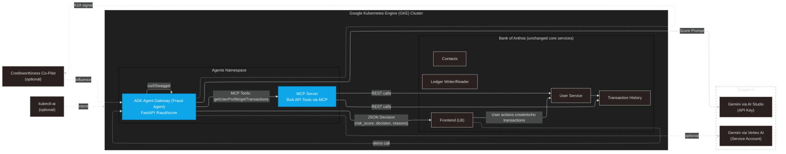

# GKE Turns 10 Hackathon Challenge – Bank of Anthos AI Agents

## Overview
This project extends **Bank of Anthos** with **agentic AI capabilities** on **Google Kubernetes Engine (GKE)**.  
We introduce new containerized agents that interact with existing APIs (without touching core services), powered by **Google AI (Gemini via AI Studio/Vertex)**.  

## Objectives
	•	Deploy containerized AI agents on Google Kubernetes Engine (GKE) that interact with Bank of Anthos via existing APIs.
	•	Integrate Google AI Studio (Gemini) to power intelligent decisions.
	•	Implement Fraud Sentinel Agent for real-time suspicious transaction detection.
	•	Keep Bank of Anthos’ core services unchanged → AI is added as an external brain.
	•	Deliver a reproducible demo + repo for hackathon judges.

## Agents include:
- **Fraud Sentinel Agent** – Detects suspicious transactions in real time.
- **(Optional) Creditworthiness Co-Pilot** – AI-assisted credit scoring.
- **(Optional) Compliance Agent** – Monitors and generates audit signals.

## High-Level Architecture: Agentic AI + GKE + Gemini

<details>
<summary><strong>Click to expand Mermaid diagram</strong></summary>


## Directory Structure (validated)
```
.
├── agents
│   ├── adk-python
│   │   ├── app
│   │   ├── Dockerfile
│   │   └── requirements.txt
│   └── mcp-server
│       ├── Dockerfile
│       ├── main.py
│       └── requirements.txt
├── bank-of-anthos        # Upstream microservices (unchanged)
├── infra/k8s             # Deployment manifests for new agents
├── docs                  # Logs + bootstrap notes
├── screenshots.sh        # Automated verification script
└── README.md             # (this file)
```
## Quickstart - To reproduce the demo quickly:

```
# 0. Clone repo
git clone https://github.com/M10vir/boa-agent-hackathon.git
cd boa-agent-hackathon

# 1. Port-forward the AI agent gateway (agents namespace → local:8082)
kubectl -n agents port-forward svc/adk-gateway 8082:8080

# 2. Health check
curl -sS http://localhost:8082/healthz | jq .

# 3. Test a low-risk transaction
curl -sS -H 'accept: application/json' \
  -X POST "http://localhost:8082/fraud/score?user_id=TESTUSER&txn_id=txn-allow&amount=1200&merchant=Coffee&geo=US" \
  | jq '{risk_score,decision,ai_backend,reasons}'

# 4. Test a higher-risk transaction
curl -sS -H 'accept: application/json' \
  -X POST "http://localhost:8082/fraud/score?user_id=TESTUSER&txn_id=txn-review&amount=6200&merchant=Electronics&geo=US" \
  | jq '{risk_score,decision,ai_backend,reasons}'

Expected:
	•	Low amount → ALLOW with reasons.
	•	High amount → REVIEW with reasons.
	•	ai_backend → "studio" confirms AI Studio path is active.
```
## Known Issues / Limitations
	•	Vertex path optional → Prepared but not shown in demo (AI Studio chosen for stability + time).
	•	Fraud Sentinel only → Creditworthiness and Compliance agents not fully implemented.
