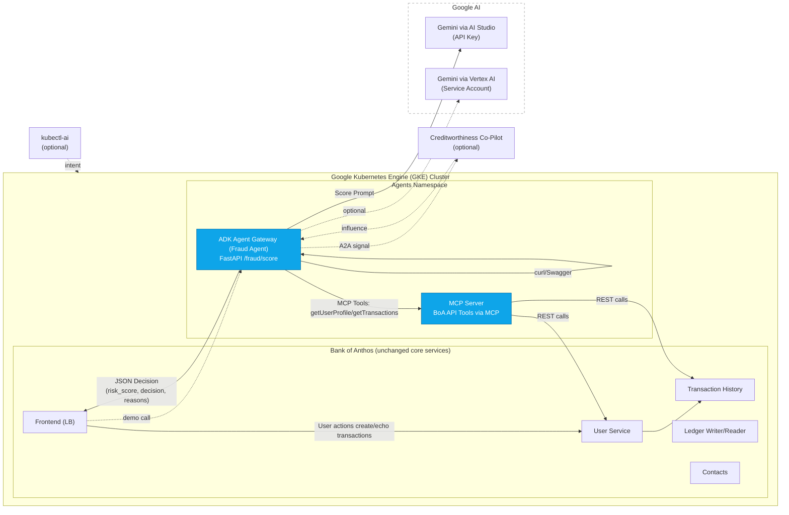

# GKE Turns 10 Hackathon Challenge – Bank of Anthos AI Agents

## Overview
This project extends **Bank of Anthos** with **agentic AI capabilities** on **Google Kubernetes Engine (GKE)**.  
We introduce new containerized agents that interact with existing APIs (without touching core services), powered by **Google AI (Gemini via AI Studio/Vertex)**.  

Agents include:
- **Fraud Sentinel Agent** – Detects suspicious transactions in real time.
- **(Optional) Creditworthiness Co-Pilot** – AI-assisted credit scoring.
- **(Optional) Compliance Agent** – Monitors and generates audit signals.

---

## 🧭 High-Level Architecture: Agentic AI + GKE + Gemini

<strong>Click to expand Mermaid diagram</strong>

## Architecture

                 ┌────────────────────────────┐
                 │  Google AI (Gemini)        │
                 │ ┌──────────────┐           │
                 │ │ AI Studio    │           │
                 │ │ (API Key)    │           │
                 │ └──────────────┘           │
                 │ ┌──────────────┐           │
                 │ │ Vertex AI    │ (opt)     │
                 │ │ (SvcAcct)    │           │
                 │ └──────────────┘           │
                 └────────────────────────────┘
                          ▲
                          │ (Prompt & Score)
                          │
        ┌─────────────────┴─────────────────┐
        │   Agents Namespace (GKE)          │
        │ ┌───────────────┐   ┌───────────┐ │
        │ │ ADK Gateway   │   │ MCP Server│ │
        │ │ /fraud/score  │◄──┤ (BoA APIs)│ │
        │ └───────────────┘   └───────────┘ │
        └───────────────────────────────────┘
                          ▲
                          │ JSON (risk_score, reasons)
                          │
        ┌─────────────────┴─────────────────┐
        │  Bank of Anthos (unchanged)       │
        │ ┌────────────┐   ┌─────────────┐ │
        │ │ Frontend   │   │ Userservice │ │
        │ │ (LB)       │──►│ TxnHistory  │ │
        │ └────────────┘   └─────────────┘ │
        └───────────────────────────────────┘
                          ▲
                          │
                 ┌────────┴────────┐
                 │   End User      │
                 │ curl/Swagger UI │
                 └─────────────────┘

  Optional:
  - A2A: Fraud Agent → Creditworthiness Agent
  - kubectl-ai: natural language → GKE ops

Quickstart (Judge-Friendly)

To reproduce the demo quickly:

# Clone repo
git clone https://github.com/M10vir/boa-agent-hackathon.git
cd boa-agent-hackathon

# Port-forward Fraud Agent Gateway
kubectl -n agents port-forward svc/adk-gateway 8082:8080 &

# Health check
curl -sS http://localhost:8082/healthz | jq .

# Test fraud scoring (Studio backend)
curl -sS -H 'accept: application/json' \
  -X POST "http://localhost:8082/fraud/score?user_id=TESTUSER&txn_id=txn-allow&amount=1200&merchant=Coffee&geo=US" \
  | jq '{risk_score, decision, ai_backend, reasons}'

Expected output (example):

{
  "risk_score": 0.2,
  "decision": "ALLOW",
  "ai_backend": "studio",
  "reasons": [
    "Transaction amount is within user's spending pattern",
    "Merchant is a known, trusted vendor"
  ]
}

---
